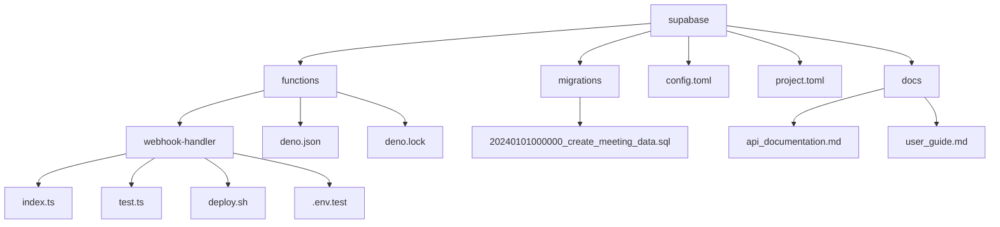

# Cline Integration Guide: RUV Bounce Method with Site-Mocking Unit Testing

This guide provides an enhanced integration of **Cline** with the RUV Bounce Method, leveraging **Requirements Refinement**, **Unification of Architecture and AI**, and **Validation and Verification** with an automated, test-first framework. Here, we’ll use multi-hop, elaborated prompts to ensure a comprehensive and structured workflow for setting up, validating, and implementing components within the project.

# Introduction to RUV Bounce Method

The **RUV Bounce Method**, enhanced with **Cline Integration**, brings a new level of precision and efficiency to AI-native development. This approach shifts development from traditional code-first workflows to a **test-first, requirement-driven** methodology, where AI plays an integral role at every stage—from defining requirements to real-time deployment validation. At the heart of this workflow is **Cline**, an autonomous coding agent that leverages AI to automate complex, multi-step processes, enabling developers to focus on high-level strategy, system architecture, and refinement rather than manually handling each aspect of implementation.

### Why Integrate Cline with the RUV Bounce Method?

The RUV Bounce Method emphasizes **Requirements Refinement, Unification of Architecture and AI,** and **Validation and Verification** (RUV). These stages ensure that every feature, function, and system component aligns with project goals, adheres to architectural standards, and passes rigorous quality control. Cline is especially valuable within this framework, as it supports each phase with **automated, multi-hop prompts** and **real-time guidance**—transforming the entire development cycle.

**Requirements Refinement** is a cornerstone of the RUV Bounce Method. In traditional development, requirements evolve alongside code, creating potential misalignments or gaps in functionality. With Cline, developers can start with clear, AI-supported tests, instantly validating requirements within a mocked environment. This approach minimizes risk by identifying missing requirements or potential issues before full code implementation, saving time and reducing errors.

**Unification of Architecture and AI** ensures that AI capabilities are foundational, not just add-ons. By using Cline for component testing and AI integration within the architecture, developers can optimize performance and alignment, ensuring AI-driven components fit seamlessly into the system.

**Validation and Verification** are where Cline’s automated test execution, error monitoring, and feedback loops excel. With Cline, developers can run tests across different environments, configurations, and edge cases, ensuring code works reliably and securely in production. Cline’s real-time monitoring and automated debugging further refine this process, catching potential issues before they escalate.

### Key Benefits of Cline Integration with the RUV Bounce Method

1. **Enhanced Productivity**: Cline’s multi-step prompt capabilities allow developers to automate repetitive tasks and streamline complex workflows, cutting down development time without sacrificing quality.

2. **Increased Accuracy and Quality Control**: By defining requirements as test cases and using Cline to refine these tests, developers reduce the risk of missed features, hidden bugs, or unforeseen issues. Cline provides prompt-based guidance, encouraging thoroughness at each step.

3. **Early Detection and Prevention of Issues**: Mock environments help identify potential failures or errors early, allowing teams to address them before they reach production. This test-first approach, powered by Cline’s real-time feedback, ensures that issues are fixed quickly and thoroughly.

4. **Scalability and Adaptability**: The combination of AI-powered test automation and flexible architecture enables projects to scale seamlessly. Whether deploying new features, adapting to new requirements, or handling larger datasets, Cline’s integration supports scalability.

5. **Enhanced Security and Compliance**: Cline facilitates thorough validation of authentication, authorization, and security protocols, ensuring robust, secure systems across environments. It supports test-driven security measures, helping developers manage sensitive data and prevent unauthorized access.

6. **Streamlined Documentation and Knowledge Sharing**: Cline’s test-first and requirements-driven approach helps document each phase automatically, making it easier for teams to follow, audit, or onboard new developers. Detailed prompts create a clear trail of development decisions, aiding transparency.

By integrating Cline into the RUV Bounce Method, organizations can transition to a **more resilient, agile, and AI-empowered development approach**. This integration optimizes time, reduces manual work, and enhances the overall quality of code, making it ideal for modern development projects where precision, security, and scalability are paramount.

---

## Project Structure Overview

This project utilizes a Supabase-based architecture, organized for serverless functions, migrations, and documentation:

```plaintext
supabase/
├── functions/                    # Serverless functions
│   ├── webhook-handler/          # Webhook processing endpoint
│   │   ├── index.ts              # Main handler logic
│   │   ├── test.ts               # Handler tests
│   │   ├── deploy.sh             # Deployment script
│   │   └── .env.test             # Test environment config
│   ├── deno.json                 # Deno configuration
│   └── deno.lock                 # Deno dependencies lock
├── migrations/                   # Database migrations
│   └── 20240101000000_create_meeting_data.sql
├── config.toml                   # Supabase configuration
└── project.toml                  # Project settings

docs/                              # Documentation
├── api_documentation.md          # API specs
└── user_guide.md                 # Usage guide
```

### Project Structure Diagram



---

## Setup and Configuration for Cline

1. **Install Cline Extension**: Download the [Cline extension](https://marketplace.visualstudio.com/items?itemName=saoudrizwan.claude-dev) from the VS Code marketplace.
2. **Open Cline**: Use `CMD/CTRL + Shift + P` and select "Cline: Open In New Tab".
3. **Configure API Provider**: Link Cline to an API provider (e.g., OpenRouter) for optimal performance.
4. **Set Project Context**: Set the project’s root directory to provide Cline access to relevant file structures and dependencies.
5. Install demo ```curl -fsSL https://deno.land/x/install/install.sh | sh1 ```
---
Here are some straightforward examples to help you start using Cline within the RUV Bounce Method, covering essential tasks from test-driven development to basic function implementation. These will help you get comfortable with setting up and running Cline multi-hop prompts for both mock tests and actual code.

---

### Example 1: Simple Mock Test for Webhook Handler

This example sets up a basic mock test to validate that the webhook handler processes payloads correctly.

```plaintext
# Step 1: Define Mock Test for Webhook Handler
"Create a mock test in supabase/functions/webhook-handler/test.ts to validate payload processing for the webhook handler. 
  - Test case 1: A valid payload returns a 200 response.
  - Test case 2: An invalid payload (e.g., missing fields) returns a 400 response.
Make sure each test checks the response status and verifies error handling for malformed payloads."

# Step 2: Run the Mock Test
"Run the test cases in webhook-handler/test.ts and display the results, ensuring both cases execute as expected."
# Continue until there are no errors. 
```

---

### Example 2: Simple Intent Detection with AI Integration

Here, we’ll set up a mock test for an AI-powered function that detects intents in a meeting transcript.

```plaintext
# Step 1: Define Mock Test for Intent Detection
"Set up a mock test in supabase/functions/webhook-handler/test.ts to validate the AI-powered intent detection function. 
  - Test case 1: A valid meeting transcript with clear intents.
  - Test case 2: An empty or invalid transcript that returns a 'no intent detected' error.
Use basic inputs to verify that the function can handle both expected and edge cases."

# Step 2: Implement Intent Detection Function
"Using the mock test as a guide, create the intent detection function in webhook-handler/index.ts. This function should send the transcript data to OpenAI’s API, receive a response, and handle cases where the confidence is low."

# Step 3: Run and Verify
"Run the mock tests in test.ts to ensure that the function handles valid and invalid transcripts appropriately. Refine error handling if any test case fails."
# Continue until there are no errors. 
```

---

### Example 3: Environment Configuration Check

This example helps validate that environment variables load correctly across different configurations, a basic but essential test.

```plaintext
# Step 1: Define Environment Configuration Mock Test
"Create a mock test in supabase/functions/webhook-handler/test.ts to validate that required environment variables load correctly. 
  - Test case 1: All required variables (API keys, URLs) are present and correctly configured.
  - Test case 2: A missing variable generates a specific error message.
Ensure each test reads from .env.test and config.toml."

# Step 2: Run Environment Tests
"Run the environment configuration tests in webhook-handler/test.ts, and display results. Adjust configurations if any environment variables are missing or incorrectly set."
# Continue until there are no errors.
```

---

### Example 4: Basic Database Test for Meeting Data Migration

This example validates a simple database migration to ensure that the schema aligns with requirements for storing meeting data.

```plaintext
# Step 1: Define Mock Test for Meeting Data Schema
"Set up a mock test in supabase/migrations/test_meeting_data.sql to verify the meeting_data table schema. 
  - Test case 1: Ensure all required fields (e.g., meeting_id, timestamp) are present.
  - Test case 2: Check data constraints like non-null fields and unique meeting_id.
This should confirm that the schema matches expectations and constraints are enforced."

# Step 2: Validate Schema in Mock Test
"Run the test for meeting_data migration in supabase/migrations and report results. Ensure that all schema and constraints match requirements."

# Continue until there are no errors. 
```

---

### Example 5: End-to-End Workflow Test from Webhook to Database

This end-to-end example tests the complete workflow, verifying that data moves from the webhook to storage in the database.

```plaintext
# Step 1: Define End-to-End Test
"Create an end-to-end mock test in supabase/functions/webhook-handler/test.ts to cover the flow from webhook receipt to database storage. 
  - Test case 1: A valid webhook payload that is processed and stored in the meeting_data table.
  - Test case 2: An invalid payload that returns a 400 error and does not store any data.
Ensure all steps verify responses and confirm data integrity in the meeting_data table."

# Step 2: Implement Workflow Logic Based on Tests
"Implement the logic in webhook-handler/index.ts to match the test cases. Ensure the handler checks payload validity, processes data, and stores results in the database."

# Step 3: Run and Refine Tests
"Run the end-to-end tests in webhook-handler/test.ts and verify the complete workflow from input to database. Refine any parts of the function that fail, ensuring a smooth end-to-end flow."

# Continue until there are no errors. 
```

---

These examples provide a foundational start to using Cline in an RUV Bounce Method workflow. By combining mock tests with targeted, specific prompts, you’ll be able to build confidence in your setup and ensure each component meets its requirements before full implementation.

## Multi-Hop Prompts for Cline: Step-by-Step Workflow with Chain of Thought Reasoning

The following sections provide elaborate multi-hop prompts to guide you through the RUV Bounce Method stages. Each prompt incorporates detailed reasoning to refine requirements, unify architecture, and validate the final implementation.

### 1. Webhook Handler Example with Requirements Refinement

This example uses multi-hop prompts to validate both successful and unsuccessful payload processing with symbolic reasoning.

```plaintext
# Step 1: Define Mock Tests with Chain of Thought for Webhook Handler
"Create mock tests for the webhook-handler function in supabase/functions/webhook-handler/test.ts. The tests should cover the following cases:
  1. Successful payload processing where valid data returns a 200 response.
  2. Failed payload processing where missing fields return a 400 error.
  3. Security: Add a check to ensure only authenticated requests are processed.
Consider edge cases, such as empty payloads, malformed data, and unauthorized access. Walk through the logic to ensure all branches of input validation are covered."

# Step 2: Implement the Webhook Handler with Symbolic Reasoning
"Using the test cases in webhook-handler/test.ts as a basis, create the webhook handler function in supabase/functions/webhook-handler/index.ts. Ensure:
  - The function first checks authentication and authorization.
  - It validates payload format and field completeness.
  - It handles errors gracefully, mapping errors to respective status codes (200 for success, 400 for bad request, 403 for unauthorized).
Write the function modularly, allowing each validation step to be isolated and tested independently."

# Step 3: Execute and Refine the Mock Tests
"Run the tests in supabase/functions/webhook-handler/test.ts to validate webhook-handler/index.ts. Identify any failing cases, particularly around edge cases, and refine the function’s error handling and validation logic to pass all tests."
# Continue until there are no errors. 
```

---

### 2. Database Migration Testing with Advanced Options

This example tests the database schema and data integrity with symbolic reasoning for constraints and edge cases.

```plaintext
# Step 1: Set Up Mock Tests for Migration Validation
"Generate mock tests for the meeting_data table in supabase/migrations/20240101000000_create_meeting_data.sql. Test cases should include:
  - Schema structure: Verify field names, types, and primary keys.
  - Data integrity: Test constraints such as non-null fields, unique identifiers, and foreign key relationships.
  - Error handling: Validate error responses for schema violations (e.g., missing required fields, duplicate entries).
Use symbolic reasoning to analyze how these constraints may interact with each other during operations."

# Step 2: Implement Data Operations with Stepwise Testing
"Implement basic data operations (INSERT, UPDATE, SELECT) for the meeting_data table in a temporary script to validate data integrity. Test scenarios:
  - Valid insertion of complete records.
  - Duplicate entries handling to ensure unique constraints are enforced.
  - Foreign key integrity to ensure related tables are referenced correctly.
Add comments explaining how each constraint enforces schema integrity and potential implications for future operations."

# Step 3: Validate Schema Constraints with Mock Test Execution
"Run all schema validation tests to confirm that meeting_data in supabase/migrations works as intended. If any constraint violations arise, provide detailed reasoning for each adjustment and its impact on overall data integrity."
# Continue until there are no errors. 
```

---

### 3. AI Intent Detection for Transcript Analysis with Chain of Thought Prompts

This example covers setting up AI-driven intent detection with structured prompts for reasoning through intent validation.

```plaintext
# Step 1: Define Mock Tests for AI Intent Detection
"Create mock tests for the intent detection feature in supabase/functions/webhook-handler/test.ts. Include cases where:
  - A valid meeting transcript is processed to extract specific intents.
  - An empty transcript returns a clear, structured error message.
  - Invalid inputs (e.g., non-text data) are handled gracefully.
Consider the reasoning flow that an AI model would follow, outlining how intent extraction relies on structured, meaningful inputs. Outline expectations for different levels of AI confidence in detected intents."

# Step 2: Implement Intent Detection Function with AI Integration
"Based on the test cases in test.ts, implement an AI-powered intent detection function in webhook-handler/index.ts. This function should:
  - Send the transcript data to OpenAI's API, expecting structured responses containing identified intents.
  - Handle responses with low confidence by returning a 'no intent detected' message.
Break down each logical step within the function, ensuring modularity to handle both valid and invalid AI responses independently."

# Step 3: Test and Refine AI Interaction in the Mock Environment
"Run the intent detection tests in test.ts. Evaluate how the AI model handles various inputs, adjusting the function to improve handling for low-confidence cases or ambiguous results. Refine the logic so that all intents are either confidently identified or explicitly marked as undetected."
# Continue until there are no errors. 
```

---

### 4. Comprehensive Integration and Environment Validation

This example uses multi-hop prompts to validate integrations and environment settings.

```plaintext
# Step 1: Verify Integration with Supabase Environment
"Create a mock test in supabase/functions/webhook-handler/test.ts to validate the integration between webhook-handler/index.ts and the Supabase database. This should cover:
  - Correct environment variable loading from .env.test.
  - Read and write access to the meeting_data table.
  - Handling of connection errors (e.g., invalid credentials).
Include chain-of-thought reasoning around potential failure points, such as network issues or incorrect configurations, and consider ways to log or alert for these cases."

# Step 2: Implement Cross-Environment Testing Logic
"Add functionality to webhook-handler/index.ts that checks the environment variables dynamically. This function should:
  - Validate that all required environment variables are present and correctly configured.
  - Handle missing configurations gracefully, logging a detailed error message.
Test this logic with .env.test and config.toml, verifying that all configurations are loaded correctly and that missing variables produce informative errors."

# Step 3: Execute Integration Tests Across Different Environments
"Run integration tests in webhook-handler/test.ts across multiple environments (.env.test and production). Verify that the system behaves as expected in each environment, focusing on the accuracy of environment-specific configurations. Ensure that all environment-based logic is functioning consistently."

# Continue until there are no errors. 
```

---

### 5. Advanced Testing and Security Validation

This example validates authentication and security configurations with symbolic reasoning for security constraints.

```plaintext
# Step 1: Set Up Mock Security Tests for Webhook Authentication
"Create mock tests in webhook-handler/test.ts for security, focusing on:
  - Authentication: Only authenticated requests should reach the main function.
  - Authorization: Unauthorized roles should not access certain endpoints.
  - Validation: Add a layer of validation to check that tokens meet required standards.
Consider symbolic reasoning for how these constraints affect security and ensure only valid tokens allow access."

# Step 2: Implement Authentication and Authorization Checks
"Implement authentication and authorization logic in webhook-handler/index.ts to match the test cases. Ensure that

:
  - Unauthorized requests return a 403 response immediately.
  - Only authenticated users with specific roles can access certain data.
Use reasoning to describe how security checks integrate with each function step, clarifying the order in which they should run for optimal security."

# Step 3: Validate Security Layers and Refine Error Handling
"Run security tests in webhook-handler/test.ts. Evaluate any failed cases and refine error messages to be descriptive but not expose sensitive information. Adjust authorization checks to ensure that only necessary data is accessible per user role."
# Continue until there are no errors. 
```

---

## Best Practices for Using Cline with the RUV Bounce Method

1. **Test-First Approach**: Begin each development cycle by defining and validating mock tests before implementing full functionality.
2. **Environment-Specific Tests**: Verify configurations across environments using `.env.test` and `config.toml`.
3. **Refine Reasoning with Detailed Prompts**: Use symbolic and chain-of-thought reasoning in prompts to guide complex logic, security, and validation.

## Resources

- [Cline VS Code Extension](https://marketplace.visualstudio.com/items?itemName=saoudrizwan.claude-dev)
- [Cline Documentation](https://github.com/cline/cline/wiki)

Using these advanced prompts and structured project workflows, you can effectively leverage **Cline** within the **RUV Bounce Method**, ensuring robust testing, clear validation, and efficient development.
